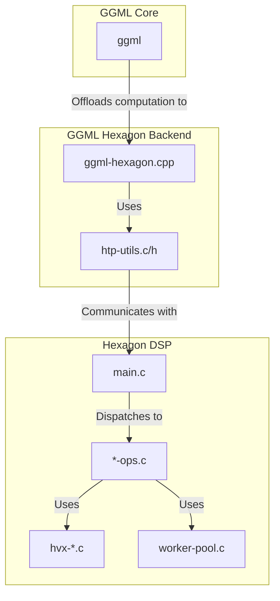
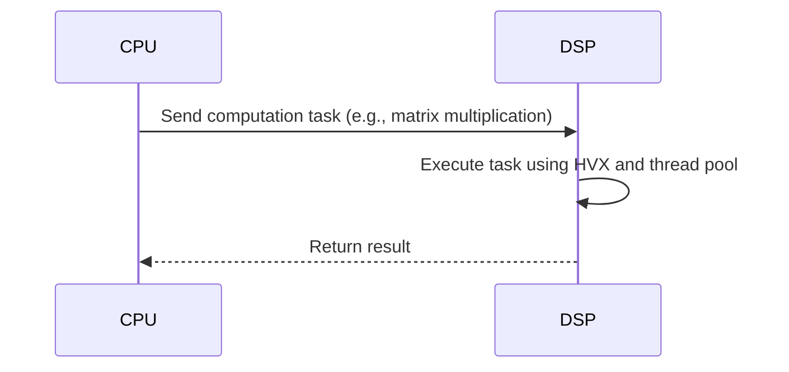

# 1. 架构概览与核心设计

## 技术栈与架构概览

- **主要技术栈**:
  - **C/C++**: 项目主要使用 C 和 C++ 编写，C 用于编写 Hexagon DSP 上的内核代码，C++ 用于编写与 `ggml` 的集成代码。
  - **Qualcomm Hexagon SDK**: 用于在 Qualcomm Hexagon DSP 上进行开发、调试和性能分析。
  - **CMake**: 用于构建和管理项目。
  - **FastRPC**: 用于 CPU 和 DSP 之间的远程过程调用。

- **架构概览**:
  - 项目是一个专门为 `ggml` 设计的后端，旨在将计算密集型任务卸载到 Qualcomm Hexagon DSP 上。
  - 架构遵循 **分层设计**，将 `ggml` 的核心逻辑与 Hexagon DSP 的具体实现分离开来。
  - 它不是一个独立的应用，而是一个可以被 `ggml` 集成的 **插件式** 模块。

## 核心架构设计原则与设计模式

- **核心架构设计原则**:
  - **高性能**: 通过利用 Hexagon Vector eXtensions (HVX) 和多线程来最大化计算性能。
  - **低延迟**: 通过 FastRPC 和 DMA 实现 CPU 和 DSP 之间的高效通信。
  - **模块化**: 将不同的操作（如矩阵乘法、激活函数等）分解到不同的文件中，便于维护和扩展。
  - **高内聚、低耦合**: `ggml-hexagon` 模块封装了与 DSP 交互的所有细节，与 `ggml` 的核心代码解耦。

- **设计模式**:
  - **代理模式 (Proxy Pattern)**: `ggml-hexagon.cpp` 可以看作是 Hexagon DSP 的代理，它接收来自 `ggml` 的计算任务，并将其转发给 DSP 执行。
  - **生产者-消费者模式 (Producer-Consumer Pattern)**: CPU 作为生产者，将计算任务放入队列；DSP 作为消费者，从队列中取出任务并执行。

## 模块划分与主要组件交互

- **模块划分**:
  - **`ggml-hexagon.cpp`**: `ggml` 后端接口的实现，负责将 `ggml` 的计算图转换为可以在 Hexagon DSP 上执行的操作。
  - **`htp-utils.c/h`**: 提供了与 Hexagon DSP 通信的实用函数，封装了 FastRPC 和内存管理的细节。
  - **`htp/` 目录**: 包含了在 Hexagon DSP 上运行的代码，其中：
    - `main.c`: DSP 端程序的入口点。
    - `*-ops.c`: 实现了各种计算操作，如矩阵乘法、激活函数等。
    - `hvx-*.c`: 包含了使用 HVX指令集进行优化的函数。
    - `worker-pool.c`: 管理 DSP 上的线程池，用于并行计算。

- **主要组件交互**:
  1. `ggml` 的计算图被发送到 `ggml-hexagon` 后端。
  2. `ggml-hexagon.cpp` 将计算图中的操作转换为 DSP 可以理解的指令。
  3. 通过 `htp-utils` 提供的函数，`ggml-hexagon.cpp` 将指令和数据发送到 DSP。
  4. DSP 上的 `main.c` 接收到指令后，调用相应的 `*-ops.c` 中的函数来执行计算。
  5. `*-ops.c` 中的函数可能会使用 `hvx-*.c` 中的函数来加速计算。
  6. 计算完成后，结果通过 `htp-utils` 返回给 `ggml-hexagon.cpp`。
  7. `ggml-hexagon.cpp` 将结果返回给 `ggml`。

## 架构图示 (Mermaid)

### 组件关系图

### 数据流图

